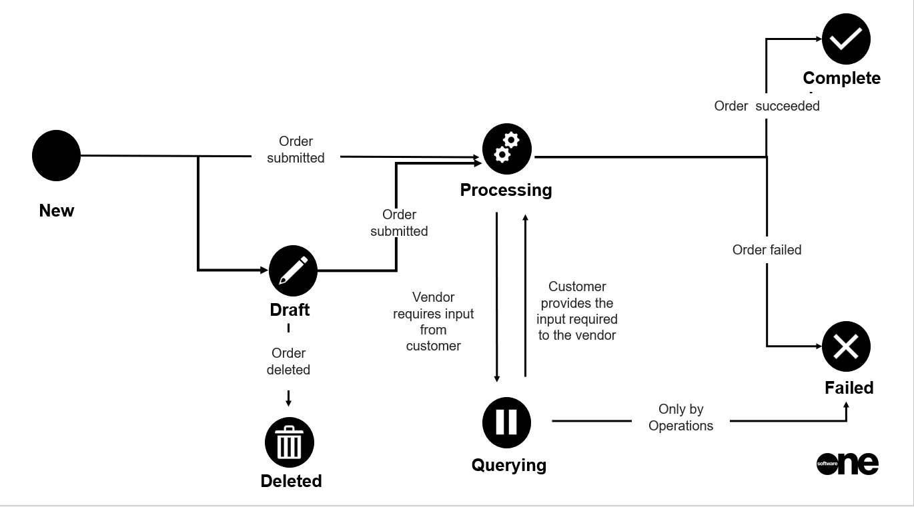

# Order States

An order can have several states from the time it is created in the Marketplace Platform until its completion.&#x20;

The following diagram shows how an order's state can change during its lifecycle:

<figure><figcaption>
Order state transition
</figcaption></figure>

These states are displayed as **Status** on the [Orders ](orders-interface.md)page. They are also displayed beside the order number on the details page.&#x20;

Note that the Marketplace Platform supports various account types, including vendor and client, so depending on your account type, only some states might be visible to you.

<table><thead><tr><th width="140">State</th><th>Definition</th></tr></thead><tbody><tr><td><strong>Draft</strong></td><td>
The order has been saved as a draft during the ordering process. 

Draft purchase orders can be accessed through the <a href="./">Orders</a> page.
</td></tr><tr><td><strong>Processing</strong></td><td>The order has been created and is currently awaiting processing by the vendor.</td></tr><tr><td><strong>Querying</strong></td><td>
The ordering parameters have been updated by the vendor. 

The order now requires an action to be taken by the client account user.
</td></tr><tr><td><strong>Completed</strong></td><td>The order has been processed by the vendor.</td></tr><tr><td><strong>Failed</strong></td><td>
The order has been failed by the vendor or SoftwareOne. 

The failure reason is shown on the <strong>General</strong> tab of the order.
</td></tr><tr><td><strong>Deleted</strong></td><td>The draft purchase order has been deleted by a client account user.</td></tr></tbody></table>

## Related topics


[orders-interface.md](orders-interface.md)



[order-states.md](order-states.md)



[buy-products-and-services.md](../products/buy-products-and-services.md)



[manage-order-notes.md](manage-order-notes.md)



[view-and-download-attachments.md](view-and-download-attachments.md)



[set-an-order-to-processing.md](set-an-order-to-processing.md)



[delete-draft-orders.md](delete-draft-orders.md)

