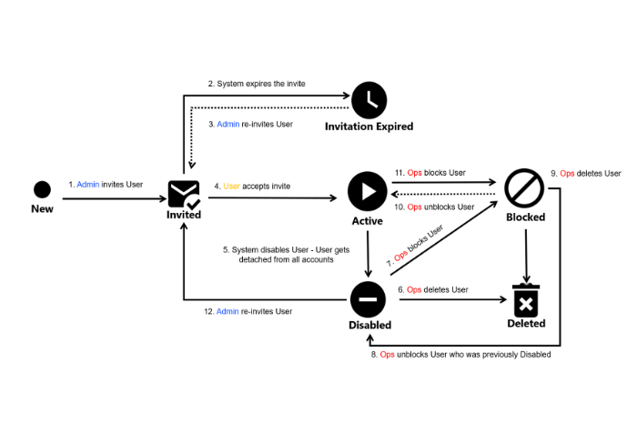

# User States

Users can have several states in the Marketplace Platform.  The following diagram shows the possible states and the transition between these states:

<figure><figcaption>
User state transition
</figcaption></figure>

<table><thead><tr><th width="186">User state</th><th>Description</th></tr></thead><tbody><tr><td><strong>Invited</strong></td><td>
The user has been invited to join an account in the Marketplace Platform, but they have not accepted the invitation. 

This status remains in place until the invitation is accepted.
</td></tr><tr><td><strong>Invitation Expired</strong></td><td>The user didn't accept the invitation within the specified period, usually seven days from the invitation date. As a result, their invitation has expired.</td></tr><tr><td><strong>Active</strong></td><td>The user has accepted the invitation. They can access the account and perform the required operations based on their permissions.</td></tr><tr><td><strong>Blocked</strong></td><td>The user has been restricted from accessing the account. This could be due to terms and conditions violations, security concerns, or at the administrator's discretion.</td></tr><tr><td><strong>Disabled</strong></td><td>The user has been removed from the account. They cannot perform any operation within the account. </td></tr><tr><td><strong>Deleted</strong></td><td>The user no longer exists in the system. </td></tr></tbody></table>

Note that the Marketplace Platform supports various account types, including vendor and client, so not all token states might be visible to you.
