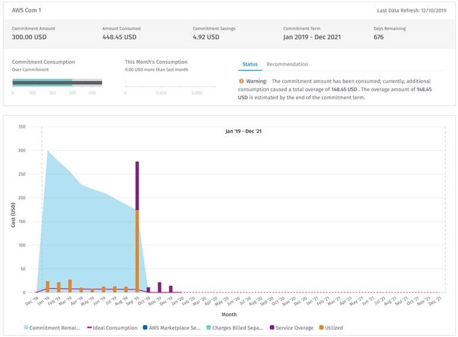

# Adding your AWS account

***

### Prerequisites 

Before starting the activation, make sure that you have the following details:

* **Account Information**: You must have your AWS account number. You can view your account number in the [AWS Management Console](https://console.aws.amazon.com/console/).&#x20;
* **Permissions**: You must have permission to execute the CloudFormation script that will create an Identity and Access Management (IAM) role in the account to be activated.


**NOTE**: If your company uses AWS Organizations and this is the first account you're activating, we recommend that you activate your master account first.&#x20;

If you start by activating a linked account, the Client Portal will discover your master account. Then you, or another user in your organization, will be required to activate the master account.&#x20;

However, if you start by activating your master account, the Client Portal will discover your linked accounts first and provide the option to activate them individually, after the master account is activated.


***

### Adding your AWS cloud account 

**To add your AWS cloud account**

1. From the main menu, navigate to **Set up** and select **Cloud tenant setup**.
2. On the Cloud Tenant Setup page, select **Add Cloud Account** and choose **Amazon Web Services** as your cloud service provider.
3. Provide the following details:
   1. A name for your AWS account.
   2. Your AWS account ID.&#x20;
4. Select the region where you want to create the CloudFormation stack. Select **Add Cloud Account**. The login page for the AWS Console opens.&#x20;


**NOTE**: Your pop-up blocker might prevent the new browser tab from opening. Ensure that the pop-up blocker is turned off. If required, enable pop-ups and select **Add Cloud Account** again.


5. Sign in to the AWS Console and perform the following steps:
   1. On the Create Stack page, review the settings that the Client Portal will use to activate your AWS account.&#x20;
   2. Select the **I acknowledge that AWS CloudFormation might create IAM resources with custom names** checkbox.
   3. Select **Create**. The CloudFormation script will start executing.
6. When the activation status changes from `CREATE_IN_PROGRESS`to `CREATE_COMPLETE`, navigate to the Client Portal, and refresh the page. Your account is activated.&#x20;

If you use AWS Organizations and have linked accounts, these accounts will be shown as **Not Activated** in the list.

***

### Activating linked accounts

Many organizations have several AWS accounts in their AWS Organizations hierarchy. In some cases, it is not the same person who owns each of those accounts. Therefore, each account owner must activate the account they own.

#### To activate linked accounts 

1. From the main menu, navigate to **Set up** and select **Cloud tenant setup**.
2. Expand the master AWS account containing the linked accounts you want to add.&#x20;
3. Select **Activate** next to the linked account that you want to activate.
4. Perform the same activation steps as for the master account. Follow steps 3-6 in [Adding your AWS cloud account](activating-your-aws-account.md#activate-your-aws-cloud-account).

***

### Activating multiple linked accounts automatically 

You can select multiple linked accounts and start the activation process automatically for all accounts.

To automate multiple linked account activations, all selected accounts must have some basic permissions. These permissions are automatically applied if the linked account has been created as a part of an organization.

If a linked account hasn’t been created as a part of an organization, but instead has only been linked to it, you must manually grant access to the `OrganizationAccountAccessRole` with the `cloudFormation:CreateStack` permission to activate that account automatically.

The process for activating multiple linked accounts is similar to the process for single account activation, except that  `AssumeRole` permission is granted to the master account. To handle the process automatically for multiple accounts, without prompting the user for additional settings for each account, additional `AssumeRole` permission is applied. This is only needed at activation. Granting this permission is done using a similar approach to single account activation. It does this using CloudFormation, SNS, and Lambda by deploying new AWS resources to handle this process.

**To activate multiple linked accounts automatically**

1. Expand the AWS account on the Cloud tenant setup page containing the linked accounts you want to add.
2. Select the checkbox next to each linked account you want to activate.
3. Select **Activate Selected**.

***

### Syncing your tags to AWS

The Client Portal works in a read-only mode after you onboard your AWS account to PyraCloud for the first time.

It means that the Tag and Resource Manager feature can import your resources and tags from AWS, but it cannot synchronize any tag changes you make in the Client Portalback to AWS.

If you would like Tag and Resource Manager to synchronize tags back to AWS, you must change the level of access the Client Portal has for your AWS account.

**To change the level of access**

1. On the Cloud Account Setup page, expand the AWS account and select **Change Access.**
2. In the **Change PyraCloud Access Level**, choose the access level:
   * **Sync resources only, no tags – write back of tags disabled**: Tag and Resource Manager will download your resources to PyraCloud without the tags currently assigned in AWS. Any changes to tags will be stored in PyraCloud only. This setting requires read-only access to your AWS account and will not make any changes to resources or tags in your AWS account.
   * **Sync resources and tags – write back of tags disabled**: Tag and Resource Manager will download your resources to PyraCloud **including** the tags currently assigned in AWS. Any changes to tags will be stored in PyraCloud only. Any tags assigned to resources in AWS will overwrite the tags for the corresponding resource in PyraCloud. This setting requires read-only access to your AWS account and will not make any changes to resources or tags in your AWS account.
   * **Sync resources and tags – write back of tags enabled**: Tag and Resource Manager will download your resources to PyraCloud including the tags currently assigned in AWS. Any changes to tags will be synchronized back to your resources in AWS. This setting requires read-write access to your AWS account and will only make changes to tags.
3. Select **Change**.

***

### Syncing AWS Cost Explorer recommendations 

The Recommendations module downloads recommendations from AWS Cost Explorer, which includes Reserved Instance purchase recommendations for Amazon EC2, Amazon RDS, ElastiCache, Amazon ES, and Amazon Redshift.&#x20;

By default, the **Enable sync with AWS Cost Explorer to see AWS Recommendations** setting is enabled in the Client Portal. It means that Client Portal will download your account's AWS Cost Explorer recommendations.

**To update the settings**

1. Expand the AWS account on the Cloud tenant setup page and select **Change Access** next to the account you want to modify.
2. In **Change PyraCloud Access Level,** choose the access level and select **Change**.
3. Review the updated access level for the account.

***

### **Enabling your Enterprise Discount Program (EDP) commitment amounts** 

If you're taking advantage of AWS’ EDP you can view your commitment amounts in the Client Portal.&#x20;

The portal displays your spending against your commitment so that you can track and plan for upcoming spend. To view your commitment amounts, contact our Support team.

<figure><figcaption></figcaption></figure>
