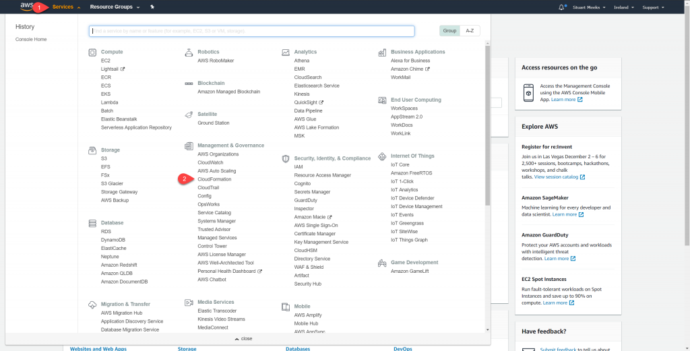
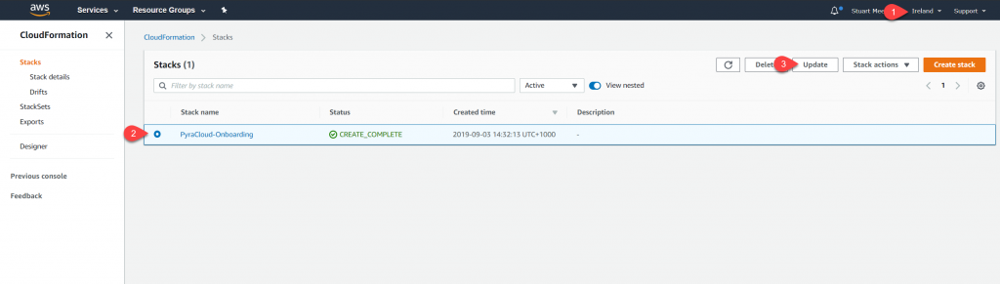
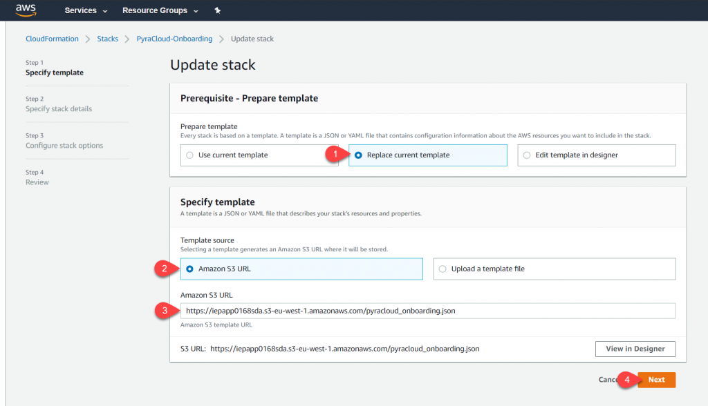
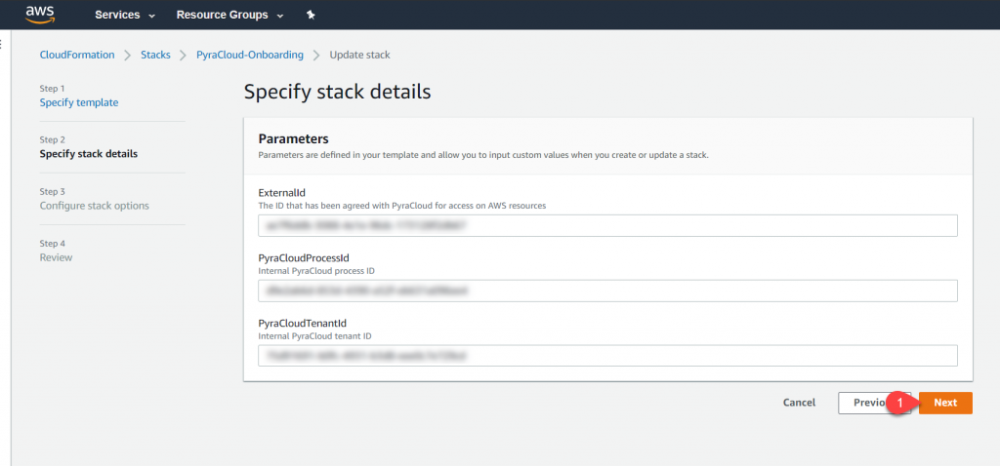

# Updating your AWS account permissions


**NOTES:**

* This topic only applies to the AWS accounts that are added using the **Add Cloud Account** functionality in Cloud Tenant Setup.
* You must have an advanced understanding of AWS, CloudFormation, and IAM policies and roles to execute these steps.


***

### Updating permissions

**To update your AWS Account permissions**&#x20;

1. Sign in to the [AWS Console Navigate](https://aws.amazon.com/console/) as a user with permission to modify IAM resources.
2. In the AWS console, select **Services** to open the list of services. Under the **Management and Governance** group, select **CloudFormation**.

<figure><figcaption></figcaption></figure>

3. Locate the Stack. In the CloudFormation console, select the correct region at the top right corner of the screen. You may need to cycle through the region until you find the stack (typically named, PyraCloud-Onboarding).
4. Select the stack and then select **Update**.

<figure><figcaption></figcaption></figure>

5. On the Update Stack page, do the following:
   1. Select the **Replace Current Template** option.&#x20;
   2. Select **Amazon S3 URL** and add the following URL: [https://iepapp0168sda.s3-eu-west-1.amazonaws.com/pyracloud\_onboarding.json](https://iepapp0168sda.s3-eu-west-1.amazonaws.com/pyracloud\_onboarding.json).
   3. Select **Next**.

<figure><figcaption></figcaption></figure>

6. On the Specify stack details page, leave the **ExternalId**, **PyraCloudProcessId**, and **PyraCloudTenantId** fields as they are. Select **Next**.

<figure><figcaption></figcaption></figure>

7.  On the Configure stack options page, leave all values as they are. Select **Next**.

    <figure><figcaption></figcaption></figure>
8. On the Review PyraCloud-Onboarding page, do the following:
   1. Review the changes that will be made to the stack.
   2. Select the **I acknowledge that AWS CloudFormation might create IAM resources with custom names** checkbox.
   3.  Select **Update Stack**.

       <figure><figcaption></figcaption></figure>
9.  Refresh the page until the stack moves from `UPDATE_IN_PROGRESS` status to `UPDATE_COMPLETE`.

    <figure><figcaption></figcaption></figure>

    <figure><figcaption></figcaption></figure>

After the update process is completed, it might take up to 24 hours for your AWS Account to become healthy.

***

### Re-onboard AWS Recommendations 

The following permissions are required to view the AWS Recommendations from AWS Trusted Advisor.

* support:\*
* trustedadvisor:Describe\*

Follow the Updating permissions section to re-onboard your AWS account with these permissions.

***

### Updating read and write-back permissions for AWS resources 

If you're unable to read resources, that is, you are missing read permissions for AWS resources, follow the Updating permissions section.

If you're unable to tag resources, that is, you are missing write-back permissions for AWS resources), follow these steps:

1.  Navigate to IAM within the AWS portal and locate `PyraCloudRole`**.**

    <figure><figcaption></figcaption></figure>
2.  Navigate to the details of the role and ensure that `ReadWritePolicy` is attached.&#x20;

    <figure><figcaption></figcaption></figure>

*   If the role is not attached, select **Attach policies**. Type **PyraCloudReadWrite** policy in the search box and then select the checkbox and select **Attach policy**.

    <figure><figcaption></figcaption></figure>

The role is attached and the write-back permissions are added. To confirm, check the Resources module by syncing the relevant AWS accounts.
